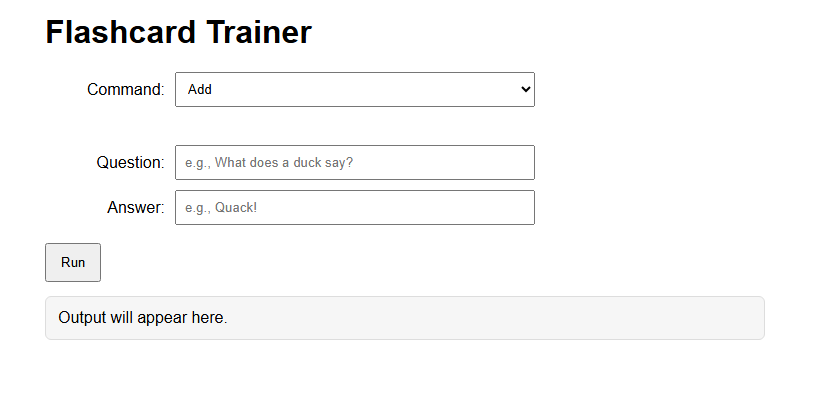
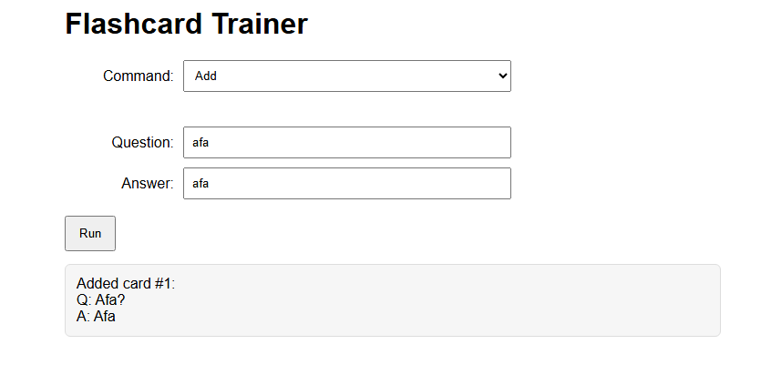
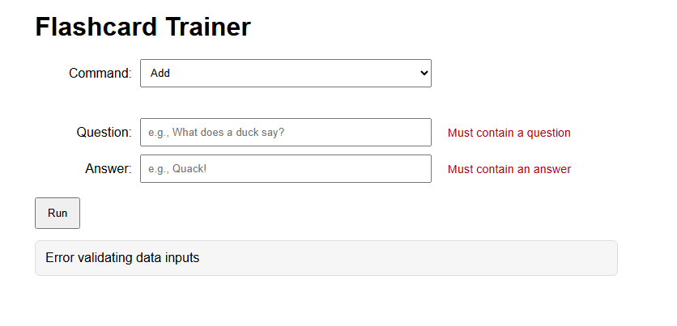

# Flashcard Trainer
## Authors
  * [Violet French](https://github.com/Pirategirl9000)
  * [Isaiah Guilliatt](https://github.com/isguil02)
  * [Rafael Negrete Fonseca](https://github.com/rnegrete01)

---

## Table of Contents
  *  ### [Variables](#global-variables)
  *  ### [Functions](#functions-and-listeners)
  *  ### [New Concepts](#new-concepts-used)
  *  ### [Output](#output)
  *  ### [Credits](#credits)

## New Concepts Used
* Array Manipulation
    * `Array.push()` - Less verbose method of adding to the end of an array
    * Clearing arrays via their length property
* String Manipulation
  * Capitilizing first letter
  * Concatenation
  * Using not operator to check for empty strings
* Switch Case w/ Default
* Links in JS Docs
* Inversion of a Boolean's Value
* [Guard Clauses](https://youtu.be/0ATjSblw9dY?si=Kf4D_hWfI0gXt9UF)

## Script Breakdown
### Global Variables
  * `questions`
    * Contains all the different questions for the flash cards
  * `answers`
    * Contains all the different answers for the flash cards
  * `currentIndex`
    * The current index of the question when quizzing
  * `displayAnswer`
    * Keeps track of whether it should display answer next when quizzing
  * `commandEl`
    * The DOM element for the recieving command input
  * `commandErrorEl`
    * A span for reporting errors related to the command input
  * `questionEl`
    * The DOM element for recieving question input
    * Used by `addCard` to append a new card's question to `questions`
  * `questionErrorEl`
    * A span for reporting errors related to the question input
  * `answerEl`
    * The DOM element for recieving answer input
    * Used by `addCard` to append a new card's answer to `answers`
  * `answerErrorEl`
    * A span for reporting errors related to the answer input
  * `outputEl`
      * The DOM element for outputting information for the user
  * `form`
    * The form containing all the input
    * An event listener is added to this to respond when the user presses the run button
### Functions and Listeners
  * `form.addEventListener("submit", (event) => {})`
    * Serves as the main entry point for the program
    * When the run button of the form is pressed this anonymous arrow function delegates the work to
      the function associated with the command entered
  * `addCard`
    * Takes in a new question and answer and adds them to the `questions` and `answers` arrays
  * `listCards`
    * List all the current cards saved to `outputEl` for the user to view
  * `loadDefault`
    * Adds a few premade flash cards to the `questions` and `answers` arrays
  * `showNextCard`
    * Shows the next card
      * If `displayAnswer` is true then it will show the answer on the card and 
        move to the next question before the next quiz iteration
  * `clearCards`
    * Clears the `questions` and `answers` arrays
  * `capitilizeFirstChar`
    * Takes in a string and returns it with the first character capitilized

## Output
### Adding Questions

### Clearing Cards

### Listing Cards

### Quizzing Over Cards

## Credits
This program is an adaptation of a script written by [Debbie Johnson](https://github.com/dejohns2)