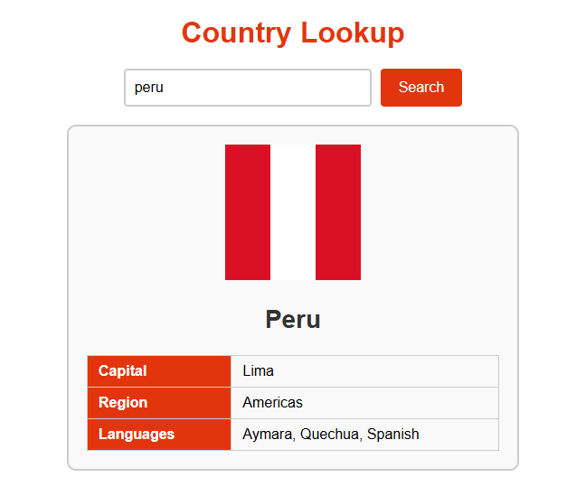

# Node Project

## Output

## Author
* [Violet French](https://github.com/Pirategirl9000)

## Table of Contents
* [Purpose](#purpose)
* [Output](#output)
* [Author](#author)
* [New Concepts](#new-concepts)
* [Script Breakdown](#script-breakdown)
* [Credits](#credits)

## Purpose
This program makes a call to the [REST countries API](https://restcountries.com/) to retrieve a country based on the user's request. It implements an LFU/TTL based cache to store requests for subsequent requests as per the principles of RESTful web services.

## New Concepts
* Node JS
* Express
  * Middleware
  * Serving Static Content
* HTTP
* Caching
  * Least Frequently Used Invalidation
  * Time-to-Live Invalidation
* Fetch API
* Proxy Servers
* Promises
* Async/Await

## Script Breakdown
* `./app.js`
  * The app file is the client side javascript that sends fetch requests to `./server.js` to request a country based on the user's input. This is served as a static file whenever any request is sent to `/api/country/{countryName}`
* `./server.js`
  * The server is a Node server with an express app mounted on it. The app's router listens for GET requests on `/api/country/{countryName}` where country name is the requested country as a path parameter ex: `/api/country/peru`
  * The server is composed of an instance of the LFUCache class of the LFUCache module which handles much of the logic of the requests and querying of data
* `./LFUCache.js`
  * The LFUCache provides a class with the same name. The cache implements TTL(can be toggled) and LFU(can be disabled by turning off max_capacity) based invalidation and can be customized to execute a callback function, `onInvalid`, on invalid or missing items
    * If a callback is not specified the errors for stale(TTL expired) or missing(ejected by LFU or never existed) packets need to be handled by the callee
    * The LFUCache provides methods for adding new items manually
  * The LFUCache constructor can take in an object for options which can contain the following properties
    * `capacity: Number` This is how big the cache should be before it starts ejecting items based on LFU, -1 or not specifying a capacity results in no max capacity
    * `TTLM: Number` This is the TTL in milliseconds for each cached item before it becomes stale and need replacement, -1 or not specifying a TTLM results in no invalidation based on TTL
    * `decayInterval: Object` These are the options for a decay interval which decrements the hits for requests to help prevent the pitfalls of LFU where some object that were once popular remain in the cache even when they aren't currently popular, not specifying a decay interval results in no decay interval
      * `amount: Number` The amount to decrement the hits by every interval tick
      * `ms: Number` How many ms to set the decay interval to
    * `onInvalid: Function` The function that is called on stale or missing items, when not specified the callee must handle stale packets or missing items manually. If set up properly you can request anything and the cache will try to get it for you. onInvalid is always passed the key for the requested item so for proper handling it's best to make your key something which can be used to retrieve the specific data

## Credits
###### This script is an adaptation of a script provided by [Murach's Modern Javascript](https://www.murach.com/shop/murach-s-modern-javascript-detail)
