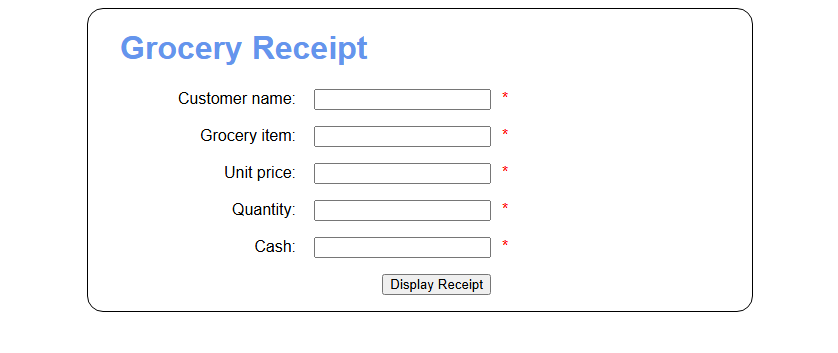
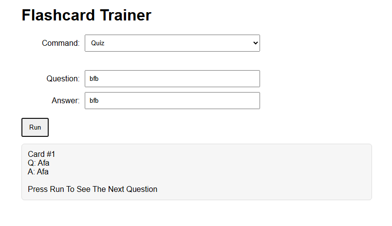
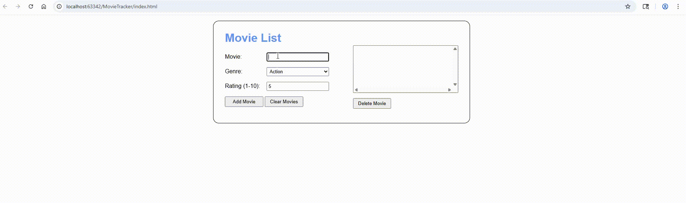

# Advanced Web Development Gateway

## Table of Contents
* [Simple Checkout](#simple-checkout)
  * [Purpose](#simple-checkout-purpose)
  * [Concepts Used](#simple-checkout-concepts-used)
  * [Output](#simple-checkout-output)
  * [Authors](#simple-checkout-authors)
  * [Repository](#simple-checkout-repository)
* [Flashcards](#flashcards)
  * [Purpose](#flashcards-purpose)
  * [Concepts Used](#flashcards-concepts-used)
  * [Output](#flashcards-output)
  * [Authors](#flashcards-authors)
  * [Repository](#flashcards-repository) 
* [Hot Cold Game](#hot-cold-game)
  * [Purpose](#hot-cold-game-purpose)
  * [Concepts Used](#hot-cold-game-concepts-used)
  * [Output](#hot-cold-game-output)
  * [Authors](#hot-cold-game-authors)
  * [Repository](#hot-cold-game-repository)  
* [Smartwatch FAQ](#smartwatch-faq)
  * [Purpose](#smartwatch-faq-purpose)
  * [Concepts Used](#smartwatch-faq-concepts-used)
  * [Output](#smartwatch-faq-output)
  * [Authors](#smartwatch-faq-authors)
  * [Repository](#smartwatch-faq-repository) 
* [Retirement Countdown](#retirement-countdown)
  * [Purpose](#retirement-countdown-purpose)
  * [Concepts Used](#retirement-countdown-concepts-used)
  * [Output](#retirement-countdown-output)
  * [Authors](#retirement-countdown-authors)
  * [Repository](#retirement-countdown-repository) 
* [Movie Tracker](#movie-tracker)
  * [Purpose](#movie-tracker-purpose)
  * [Concepts Used](#movie-tracker-concepts-used)
  * [Output](#movie-tracker-output)
  * [Authors](#movie-tracker-authors)
  * [Repository](#movie-tracker-repository)
 

## Simple Checkout
---
### Simple Checkout Purpose
Displays a webpage that allows the user to input values that will then be turned into a grocery receipt summarizing the inputs and calculating the change they get back. Displays the output of the receipt in a Javascript alert message

### Simple Checkout Concepts Used
* Alert messages
* Grabbing values from DOM
* Input validation
* Number parsing
* JS Arithmetic

### Simple Checkout Output

### Simple Checkout Authors
* [Brayden Hermanson](https://github.com/brherm05)
* [Violet French](https://github.com/Piratgirl9000)

### Simple Checkout Repository
* [Local Codebase](https://github.com/Pirategirl9000/AdvancedWebDevelopmentGateway/tree/main/Simple-Checkout)
* [Native Repository](https://github.com/Pirategirl9000/Simple-Checkout)

[Back to Top](#advanced-web-development-gateway)

---
## Flashcards
---
### Flashcards Purpose
This program allows the creation of flashcards for studying and quizzing using a graphical interface

### Flashcards Concepts Used
* Array Manipulation
    * `Array.push()` - Less verbose method of adding to the end of an array
    * Clearing arrays via their length property
* String Manipulation
  * Capitilizing first letter
  * Concatenation
  * Using not operator to check for empty strings
* Switch Case w/ Default
* Links in JS Docs
* Inversion of a Boolean's Value
* [Guard Clauses](https://youtu.be/0ATjSblw9dY?si=Kf4D_hWfI0gXt9UF)

### Flashcards Output

### Flashcards Authors
* [Violet French](https://github.com/Pirategirl9000)
* [Isaiah Guilliatt](https://github.com/isguil02)
* [Rafael Negrete Fonseca](https://github.com/rnegrete01)

### Flashcards Repository
* [Local Codebase](https://github.com/Pirategirl9000/AdvancedWebDevelopmentGateway/tree/main/Flashcards)
* [Native Repository](https://github.com/Pirategirl9000/Flashcards)

[Back to Top](#advanced-web-development-gateway)

---
## Hot Cold Game
---

### Hot Cold Game Purpose
This program creates a guessing number game for the user. The user will try to guess a number with the program giving them hints based on their proximity like the game Hot-Cold. It also tracks the best score for each attempt

### Hot Cold Game Concepts Used
* Randomization
* Event Listeners (Click, Key, ContentLoaded)
* Ternary Expressions
* Styling from JS
* DOM Manipulation

### Hot Cold Game Output

### Hot Cold Game Authors
* [Violet French](https://github.com/Pirategirl9000)

### Hot Cold Game Repository
* [Local Codebase](https://github.com/Pirategirl9000/AdvancedWebDevelopmentGateway/tree/main/HotColdGame)
* [Native Repository](https://github.com/Pirategirl9000/HotColdGame)

[Back to Top](#advanced-web-development-gateway)

---
## Smartwatch FAQ
---
### Smartwatch FAQ Purpose
This program displays an FAQ page for a smartwatch that uses collapsible panels for questions. When the question is clicked an answer appears and a corresponding image is displayed at the top

### Smartwatch FAQ Concepts Used
* Adding/Removing classes from DOM elements
* Checking for and grabbing custom HTML attributes from DOM elements
* Grabbing next elements based on sibling relationship of DOM elements
* Checking equality of DOM elements
* Finding the target of an `Event` object
* Toggling the class of a DOM element
* Mutation of an array using `Array.forEach()`
  
### Smartwatch FAQ Output

### Smartwatch FAQ Authors
* [Violet French](https://github.com/Pirategirl9000)
* [Sarah Fenton](https://github.com/sarahfenton204)

### Smartwatch FAQ Repository
* [Local Codebase](https://github.com/Pirategirl9000/AdvancedWebDevelopmentGateway/tree/main/Smartwatch-FAQ)
* [Native Repository](https://github.com/Pirategirl9000/Smartwatch-FAQ)

[Back to Top](#advanced-web-development-gateway)

---
## Retirement Countdown
---
### Retirement Countdown Purpose
The purpose of this program is to take in information about the user's financials (savings balance, monthly savings additions, interest rate) and information about the person (name, email) and the date they want to retire. It then uses this data to determine what the projected income of the user will be based on their financials on their projected retirement date.

### Retirement Countdown Concepts Used
* Date Manipulation
* Intervals
* Regex & Data Validation
* Error Creation and Handling
* Regional Money Formatting
* Local Storage manipulation

### Retirement Countdown Output

### Retirement Countdown Authors
* [Violet French](https://github.com/Pirategirl9000)

### Retirement Countdown Repository
* [Local Codebase](https://github.com/Pirategirl9000/AdvancedWebDevelopmentGateway/tree/main/Retirement-Countdown)
* [Native Repository](https://github.com/Pirategirl9000/Retirement-Countdown)

[Back to Top](#advanced-web-development-gateway)

---
## Movie Tracker
---

### Movie Tracker Purpose
This program uses classes and modules to create an OOP based movie tracker program wherein you can enter a movie, its genre, and a rating for it and it will be save to the browser's local storage and displayed in a side panel. You can also remove or clear movies removing them from both local storage and the side panel.

### Movie Tracker Concepts Used
* Classes
* Objects
* Modules
* Symbol.iterator
* Advanced Array Manipulation

### Movie Tracker Output

### Movie Tracker Authors
* [Violet French](https://github.com/Pirategirl9000)

### Movie Tracker Repository
* [Local Codebase](https://github.com/Pirategirl9000/AdvancedWebDevelopmentGateway/tree/main/MovieTracker)
* [Native Repository](https://github.com/Pirategirl9000/MovieTracker)

[Back to Top](#advanced-web-development-gateway)
