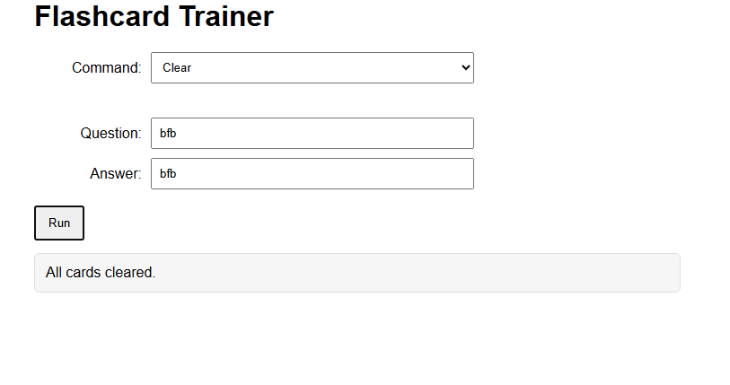
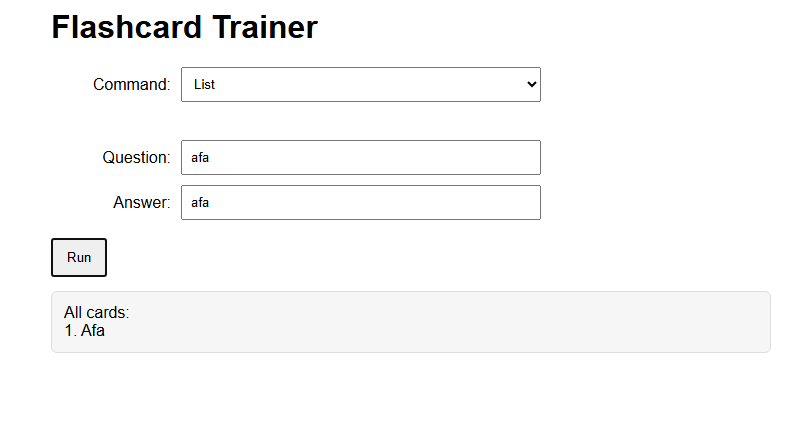
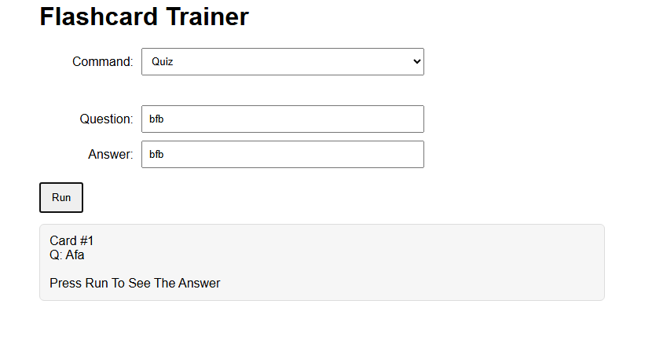

# Advanced Web Development Gateway

## Table of Contents
* [Simple Checkout](#simple-checkout)
  * [Purpose](#simple-checkout-purpose)
  * [Concepts Used](#simple-checkout-concepts-used)
  * [Output](#simple-checkout-output)
  * [Authors](#simple-checkout-authors)
  * [Repository](#simple-checkout-repository)
* [Flashcards](#flashcards)
  * [Purpose](#flashcards-purpose)
  * [Concepts Used](#flashcards-concepts-used)
  * [Output](#flashcards-output)
  * [Authors](#flashcards-authors)
  * [Repository](#flashcards-repository) 
* [Hot Cold Game](#hot-cold-game)
  * [Purpose](#hot-cold-game-purpose)
  * [Concepts Used](#hot-cold-game-concepts-used)
  * [Output](#hot-cold-game-output)
  * [Authors](#hot-cold-game-authors)
  * [Repository](#hot-cold-game-repository)  
* [Smartwatch FAQ](#smartwatch-faq)
  * [Purpose](#smartwatch-faq-purpose)
  * [Concepts Used](#smartwatch-faq-concepts-used)
  * [Output](#smartwatch-faq-output)
  * [Authors](#smartwatch-faq-authors)
  * [Repository](#smartwatch-faq-repository) 
* [Retirement Countdown](#retirement-countdown)
  * [Purpose](#retirement-countdown-purpose)
  * [Concepts Used](#retirement-countdown-concepts-used)
  * [Output](#retirement-countdown-output)
  * [Authors](#retirement-countdown-authors)
  * [Repository](#retirement-countdown-repository) 
* [Movie Tracker](#movie-tracker)
  * [Purpose](#movie-tracker-purpose)
  * [Concepts Used](#movie-tracker-concepts-used)
  * [Output](#movie-tracker-output)
  * [Authors](#movie-tracker-authors)
  * [Repository](#movie-tracker-repository) 

## Simple Checkout
---
### Simple Checkout Purpose
Displays a webpage that allows the user to input values that will then be turned into a grocery receipt summarizing the inputs and calculating the change they get back. Displays the output of the receipt in a Javascript alert message

### Simple Checkout Concepts Used
* Alert messages
* Grabbing values from DOM
* Input validation
* Number parsing
* JS Arithmetic

### Simple Checkout Output

### Simple Checkout Authors
* [Brayden Hermanson](https://github.com/brherm05)
* [Violet French](https://github.com/Piratgirl9000)

### Simple Checkout Repository
* [Local Codebase](https://github.com/Pirategirl9000/AdvancedWebDevelopmentGateway/tree/main/Simple-Checkout)
* [Native Repository](https://github.com/Pirategirl9000/Simple-Checkout)

---
## Flashcards
---
### Flashcards Purpose
This program allows the creation of flashcards for studying and quizzing using a graphical interface

### Flashcards Concepts Used
* Array Manipulation
    * `Array.push()` - Less verbose method of adding to the end of an array
    * Clearing arrays via their length property
* String Manipulation
  * Capitilizing first letter
  * Concatenation
  * Using not operator to check for empty strings
* Switch Case w/ Default
* Links in JS Docs
* Inversion of a Boolean's Value
* [Guard Clauses](https://youtu.be/0ATjSblw9dY?si=Kf4D_hWfI0gXt9UF)

### Flashcards Output
#### Adding Questions

#### Clearing Cards

#### Listing Cards

#### Quizzing Over Cards

### Flashcards Authors
* [Violet French](https://github.com/Pirategirl9000)
* [Isaiah Guilliatt](https://github.com/isguil02)
* [Rafael Negrete Fonseca](https://github.com/rnegrete01)

### Flashcards Repository
* [Local Codebase](https://github.com/Pirategirl9000/AdvancedWebDevelopmentGateway/tree/main/Flashcards)
* [Native Repository](https://github.com/Pirategirl9000/Flashcards)

---
## Hot Cold Game
---

### Hot Cold Game Purpose

### Hot Cold Game Concepts Used

### Hot Cold Game Output

### Hot Cold Game Authors

### Hot Cold Game Repository

---
## Smartwatch FAQ
---
### Smartwatch FAQ Purpose

### Smartwatch FAQ Concepts Used

### Smartwatch FAQ Output

### Smartwatch FAQ Authors

### Smartwatch FAQ Repository

---
## Retirement Countdown
---
### Retirement Countdown Purpose

### Retirement Countdown Concepts Used

### Retirement Countdown Output

### Retirement Countdown Authors

### Retirement Countdown Repository

---
## Movie Tracker
---

### Movie Tracker Purpose

### Movie Tracker Concepts Used

### Movie Tracker Output

### Movie Tracker Authors

### Movie Tracker Repository
